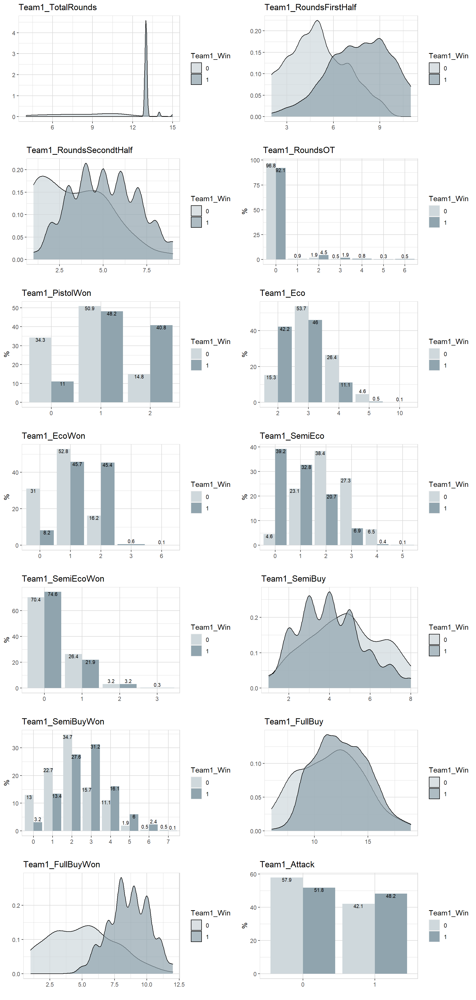

# 1. Introduction

Valorant is first person shooter compettitive game that's currently hottest game in this game type beside CS:GO. I myself have play this game together with my group of friends and beginning to doubt why we're struggle to rank up. So I decide to find what factor will lead our squad to victory.

# 2. Obtain

The data I will use to perform this analysis was obtained from [this](https://www.kaggle.com/datasets/visualize25/valorant-pro-matches-full-data) Kaggle dataset which was obtained via vlr.gg. It includes data from Valorant's pro match up to Jan 1,2022. This dataset was come in SQLite type, included 4 tables in it like Game_Rounds, Game_Scoreboard, Games, Matches. But this analysis is just base on Games table because it's represent my interested fields.

## 2.1 Glossary of Features:

-   TotalRound: Total win round of observing team. Normally it's equal 13 round (Game's winning condition is for which team reach 13 round win first will win the match).

-   SideFirstHalf: Valorant is compettitive game, so it must altered between attack and defense team.

-   RoundOT: The overtime round, If 2 teams have 12 wins equally, they must win 2 rounds in row to win the match.

-   RoundFirstHalf/ SecondHalf: There are 12 round each half for defending or attacking.

-   Pistol: Normally it's the first round of each side. Each team will start with free pistol or can buy some pistol of choice. In my perspective, the pistol round will determine which team will win the match.

-   Eco: Means Economy round. If your team fall behind in economy some leader in the team will call for economy round. They will have to save **all** of money to buy bigger guns in the next round (Full buy) for more impact round.

-   SemiEco: Similar to Eco but they just buy some abilities and smaller pistol to increase winning chance.

-   SemiBuy: In this round, players can buy some medium gun and abilities. But they aren't much effective as the rifles or heavier gun in FullBuy round. - FullBuy: Buy the best gun and every ability you want to maximize winning chance!

```{r}
# Connect R to database
library(RSQLite)

# 1. Connect DB
conn <- dbConnect(SQLite(), "data/valorant.sqlite")

# 2. List Table
dbListTables(conn)

# 3. List Fields
dbListFields(conn, "Games")

# 4. Query data
Games <- dbGetQuery(conn, "SELECT * 
                    FROM Games LIMIT 1001")
dbDisconnect(conn)
```

# 3. Clean

## 3.1 Data Preparation

```{r}
#  load tidyverse library and caret for data transformation and machine learning in advance
library(tidyverse)
library(caret)
library(ranger)
library(caTools) #for logistic regression

# find total NA values
summary(Games)
sum(is.na(Games))
# delete NA row and re-select data from 1000 rows to 1001 rows
Games <- na.omit(Games)

# check Column name
names(Games)
  ## since I want to see Team 1 winning conditions so I cut other non Team 1 related column
tGames <- Games %>%
  select(Map, Team1, Team2, Winner, starts_with("Team1_")) %>%
  mutate(Team1_Win = if_else(Team1 == Winner, 1, 0),
         Team1_Attack = if_else(Team1_SideFirstHalf == "attack", 1, 0))
         # create 2 new column and change Team1_win into factor

  ## select the working data
tGames2 <- tGames %>%
  select(starts_with("Team1_"), -Team1_SideFirstHalf)
```

# 4. Data Exploration

```{r}
# visulize data to see more correlated value with correlation matrix
library(corrplot) #correlation plot matrix
library(RColorBrewer)
M <- cor(tGames2)
corrplot(M, type="upper", order="hclust",
         col=brewer.pal(n=8, name="RdYlBu"))

# explore data
library(explore) # library for exploring
# explore(tGames2) # interactive data can't run on R mark down

```

{width="720"}

As we can see from correlation plot matrix and explored variables. The FullBuy play the most important roles for winning more. On the other hand, the more you do semi-buy round the more likelihood to lose.

# 5. Model

Now we have seen that there is some relationship between the winning chance and other buy rounds, I want to dive deeper to create a model that can predicts the outcome of a match.

I will use four model types 1. Logistic regression 2.Classification and regression trees (CART) 3. K-Nearest Neighbor (KNN) 4. Random forest (ranger).

I'm going to change column type to factor for using in model.
```{r}
## change column type from numeric to factor
tGames2 <- tGames2 %>%
  select(starts_with("Team1_")) %>%
  mutate(Team1_Win = as.factor(Team1_Win),
         Team1_Attack = as.factor(Team1_Attack))
    # create 2 new columns and change their type to factor
```

Then, it's time for modeling.
```{r}
# split data for training and testing
set.seed(11)
id <- createDataPartition(tGames2$Team1_Win, p = 0.8, list = F)

train_data <- tGames2[id, ] #train80%
test_data <- tGames2[-id, ] #test20%

#set train control to k-fold cv
set.seed(11)
ctrl <- trainControl(method = "cv",
                     number = 5,
                     verboseIter = TRUE)

# build models
    ## Logistic
set.seed(11)
logit_model <- train(Team1_Win~.,
                   data = train_data,
                   method = "LogitBoost",
                   metric = "Accuracy",
                   trControl = ctrl)
    ##CART
set.seed(11)
cart_model <- train(Team1_Win~.,
                     data = train_data,
                     method = "rpart",
                     metric = "Accuracy",
                     trControl = ctrl)
    ##knn
set.seed(11)
knn_model <- train(Team1_Win~.,
                     data = train_data,
                     method = "knn",
                     metric = "Accuracy",
                     trControl = ctrl)
    ## Randomforest
set.seed(11)
ranger_model <- train(Team1_Win~.,
                     data = train_data,
                     method = "ranger",
                     metric = "Accuracy",
                     trControl = ctrl)

```

Overall, the model is completed. But which model is the best to predict the winning team?

```{r}
# select best model
  ## summarise accuracy of models
results <- resamples(list(logit = logit_model,
                          cart = cart_model,
                          knn = knn_model,
                          ranger = ranger_model))
summary(results)
  ## compare accuracy of models
dotplot(results)
  ## summarise bets model
print(ranger_model)
```

So, the Random forest model (ranger) has the most accuracy from our 5 models.  
Let's try to predict the test data for confirm our result and evaluate

```{r}
# score and evaluate
p <- predict(ranger_model, test_data)
cmatrix <- confusionMatrix(p, test_data$Team1_Win)

print(cmatrix)
```

# 6. Conclusion

Based on the above findings we can see that Fullbuy round play the most important roles for winning. I assume that the more fullbuy round will lead to less eco rounds and less eco rounds means you lose less either.

So, if you want to win more you should focus in economy in game for more fullbuy round. That's all I can extract from this analysis.

## 6.1 Further recommedations for this analysis

This is my first real life problem project for me as a beginner data scientist. But my thought to my project is I can squeeze some more meaningful insight if I became better at this. Such as, I want to change the Eco round and Eco win to be Eco_Win_Percentage. But when I tried it there was some error that occurred and the NA values are coming when my divider data was 0 and I can't do anything to it.

Furthermore, My Machine learning of choice maybe not that good. Might be from the lack of knowledge and experience.

